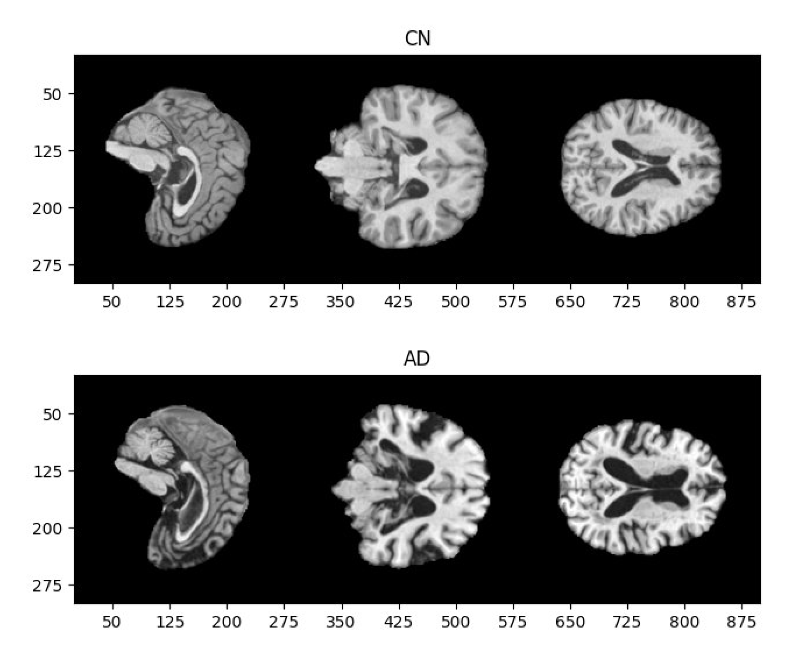
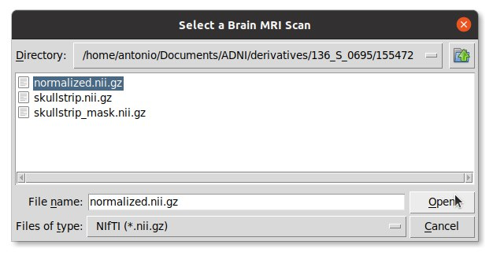
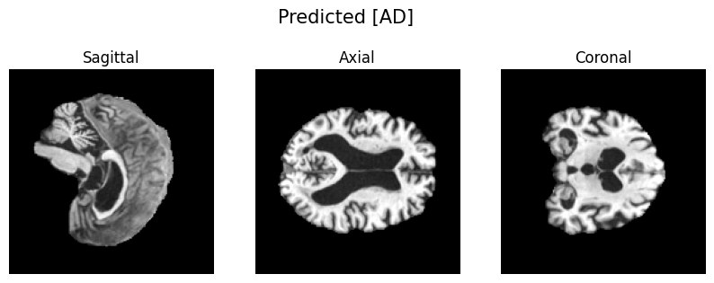

# Alzheimer’s Detection Through MRI

[](https://www.codefactor.io/repository/github/antonioscardace/Tina/overview/main)
[](https://github.com/antonioscardace/Tina/blob/master/LICENSE)
[](https://github.com/antonioscardace/Tina/issues)
[](/docs/credits.txt)

This project was developed as part of the Machine Learning course examination. It focuses on medical imaging, specifically analysing a large number of brain MRIs aimed at proficiently classifying and identifying abnormalities indicative of or ruling out the presence of Alzheimer's disease (AD).

Using the **ADNI** dataset sourced from the [University of South Carolina](https://ida.loni.usc.edu/login.jsp), I selected **2073 MRIs** for analysis. The goal is to classify brain MRIs into **2 different diagnostic categories**: 
* Cognitively Normal `CN` **(65.05%)**
* Alzheimer's Disease `AD` **(34.95%)**

<p align="center">
   
</p>

After obtaining the dataset [access](https://adni.loni.usc.edu/data-samples/access-data/), a CSV file of **T1-weighted** brain MRIs for **AD** and **CN** diagnoses was downloaded to `/data/raw/collection.csv`. The dataset was filtered and cleaned, ensuring no more than two MRIs per patient were selected, and the corresponding `.zip` files were downloaded to the `/data/images/` directory. Once the images were downloaded, custom bash scripts were used to extract and organize the MRI scans before preprocessing. More info is available in the [project report](/docs/report.pdf).

The dataset was partitioned into a **Training Set (60%)**, a **Validation Set (20%)** and a **Test Set (20%)**. Using a specialized **3D DenseNet** model, the project focused on binary classification of brain MRI scans. As a result, the model achieved a final F1-Score of **84.39%**, a Precision of **82.63%**, a Recall of **86.23%**, an AUC of the ROC curve of **88.60%**, and an Accuracy of **89.39%** on the Test Set.

## Inference Demo

<p align="center">
   <br/>
   
</p>

## How to Use

Before you begin, ensure that you meet the following prerequisites:

* Sufficient GPU, CPU, and RAM for computational tasks.
* At least 80GB of free disk space.
* Unix-based operating system.
* Install these three toolkits: [ANTs](https://github.com/ANTsX/ANTs), [HD-BET](https://github.com/MIC-DKFZ/HD-BET), and [Intensity Normalization](https://github.com/jcreinhold/intensity-normalization).
* The use of [Anaconda](https://www.anaconda.com/) is recommended.

If you meet these requirements, run the following commands:

```sh
   $ git clone https://github.com/antonioscardace/Tina.git
   $ cd Tina/
   $ pip install -r requirements.txt
```

Once you’ve followed the instructions above and obtained the zip files, run these commands:

```sh
   $ bash data/images/00-extract.sh
   $ bash data/images/01-organise.sh
   $ bash data/images/02-transform.sh
   $ bash data/images/03-preproc.sh
```

You're all set! I recommend conducting manual quality control on preprocessed images.<br/>
Following this, you can work on the project using any [available notebook](/notebooks/).