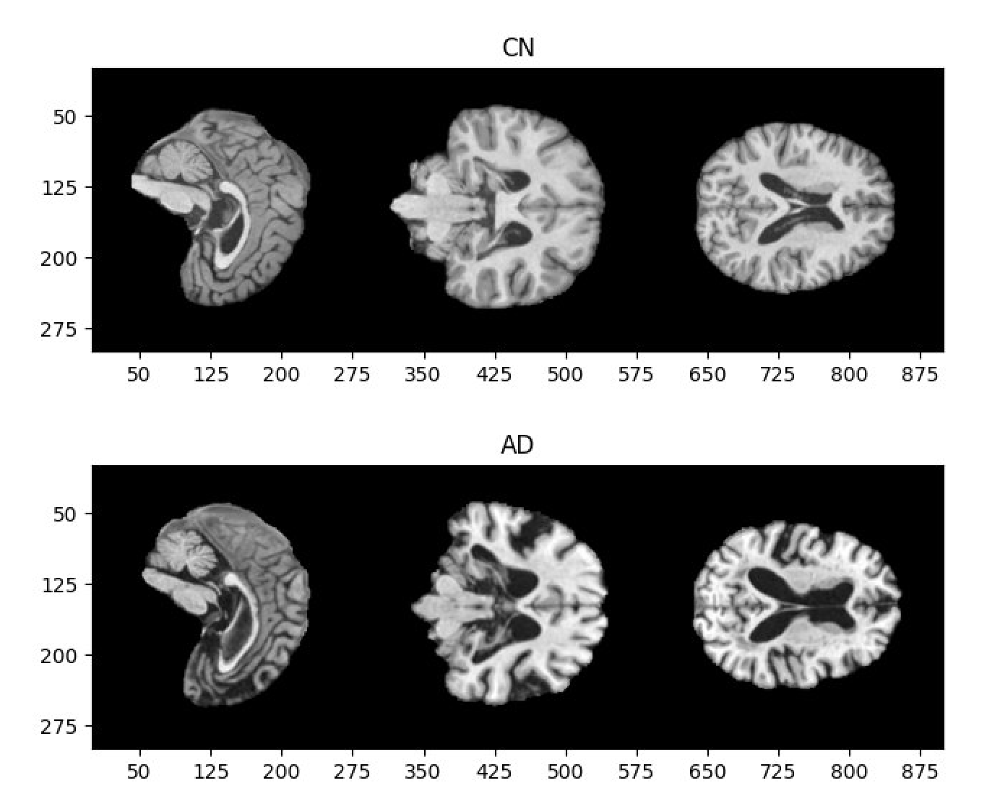
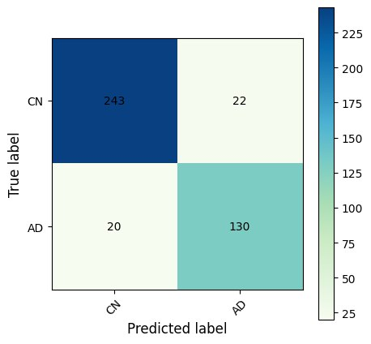
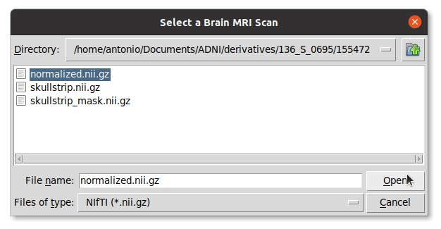
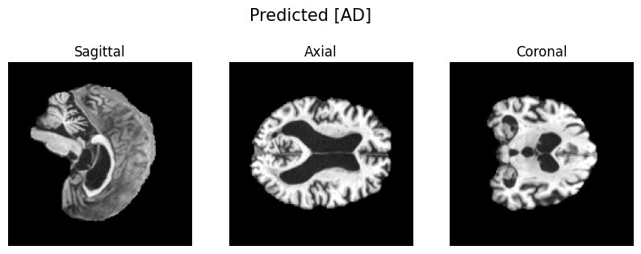

# Tina • Alzheimer's Detection via Brain MRI

_Project for "Machine Learning" course_<br/>
_Grade: 30 with honors / 30_<br/>
_[Antonio Scardace](https://linktr.ee/antonioscardace)_ @ _Dept of Math and Computer Science, University of Catania_

[](https://www.codefactor.io/repository/github/antonioscardace/Tina/overview/main)
[](https://github.com/antonioscardace/Tina/blob/master/LICENSE)
[](/docs/credits.txt)

## Introduction

This project was developed as part of the Machine Learning course examination. It focuses on medical imaging, specifically analysing a large number of brain MRIs aimed at proficiently classifying and identifying abnormalities indicative of or ruling out the presence of Alzheimer's disease (AD).

Using the **ADNI** dataset sourced from the [University of South Carolina](https://ida.loni.usc.edu/login.jsp), I selected **2074 MRIs** for analysis. The goal is to classify brain MRIs into **2 different diagnostic categories**: 
* Cognitively Normal `CN` **(65.05%)**
* Alzheimer's Disease `AD` **(34.95%)**

<p align="center">
   
</p>

The dataset was partitioned into a **Training Set (60%)**, a **Validation Set (20%)** and a **Test Set (20%)**. Using a specialized **3D DenseNet** model, the project focused on binary classification of brain MRI scans. As a result, the model achieved a final **F1-Score** of **86.09%**, a **Precision** of **85.52%**, a **Recall** of **86.66%**, an **AUC of the ROC** curve of **89.97%**, and an **Accuracy** of **89.87%** on the Test Set.

<p align="center">
   
</p>

## Data Preparation

This process involves several key steps. Initially, the dataset is [accessed](https://adni.loni.usc.edu/data-samples/access-data/) and prepared. Detailed instructions for these steps can be found in the [project report](/docs/report.pdf). In essence, the process includes accessing the **T1-weighted** brain MRI dataset, selecting MRIs specifically for **CN** and **AD** diagnoses, cleaning and sampling the dataset to ensure a maximum of two MRIs per patient, and organizing the dataset into the necessary directories.

Each MRI undergoes preprocessing, resulting in a normalized, skull-stripped, and corrected brain MRI. After the scans were extracted and organised, a preprocessing script was used to complete the following steps for each image, taking approximately 2 minutes per image:

| Step                    | Script                       | Software (Algorithm)                                         |
| ----------------------- | ---------------------------- | ------------------------------------------------------------ |
| Bias-Field Correction   | `N4BiasFieldCorrection`      | [ANTs](https://github.com/ANTsX/ANTs) (N4)                   |
| Affine Registration     | `antsRegistrationSyNQuick.sh`| [ANTs](https://github.com/ANTsX/ANTs) (SyN)                  |
| Skull Stripping         | `hd-bet`                     | [HD-BET](https://github.com/MIC-DKFZ/HD-BET) (HD-BET)        |
| Intensity Normalization | `ws-normalize`               | [intensity-normalization](https://github.com/jcreinhold/intensity-normalization) (WhiteStrip) |

## Inference Demo

<p align="center">
   
   
</p>

## How to Use

Before you begin, ensure that you meet the following prerequisites:

* Sufficient GPU, CPU, and RAM for computational tasks.
* At least 80GB of free disk space.
* Unix-based operating system.
* Install these three toolkits: [ANTs](https://github.com/ANTsX/ANTs), [HD-BET](https://github.com/MIC-DKFZ/HD-BET), and [Intensity Normalization](https://github.com/jcreinhold/intensity-normalization).

If you meet these requirements, run the following commands:

```sh
   $ git clone https://github.com/antonioscardace/Tina.git
   $ cd Tina/
   $ pip install -r requirements.txt
```

To prepare the images for training as described, run the following commands:

```sh
   $ bash data/images/00-extract.sh
   $ bash data/images/01-organise.sh
   $ bash data/images/02-transform.sh
   $ bash data/images/03-preproc.sh
```

You're all set! I recommend conducting manual quality control on preprocessed images.<br/>
Following this, you can work with the project using any [available notebook](/notebooks/).
